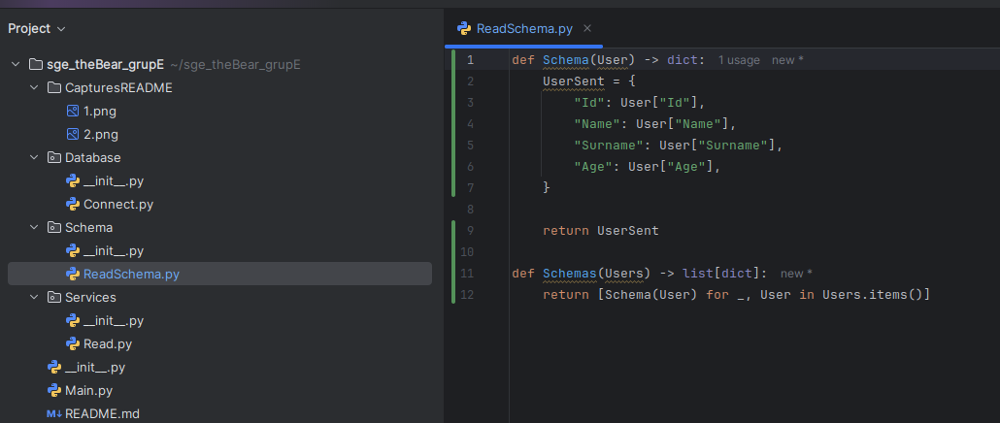

# sge_theBear_grupE

He creat l'estructura de fitxers sense codi.

He afegit el codi de Connect.py. (Connexió a la base de dades)

He afegit el codi de ReadSchema.py. (Crea un schema i genera diccionaris unics per representar a tots els usuaris en forma de llista)

