# sge_theBear_grupE

He creat l'estructura de fitxers sense codi.

He afegit el codi de Connect.py. (Connexió a la base de dades)

He afegit el codi de ReadSchema.py. (Crea un schema i genera diccionaris unics per representar a tots els usuaris en forma de llista)

He afegit el codi de Read.py. (Crea un diccionari de diccionaris i retorna la versió en llista dels diccionaris utilitzant ReadSchema.py)

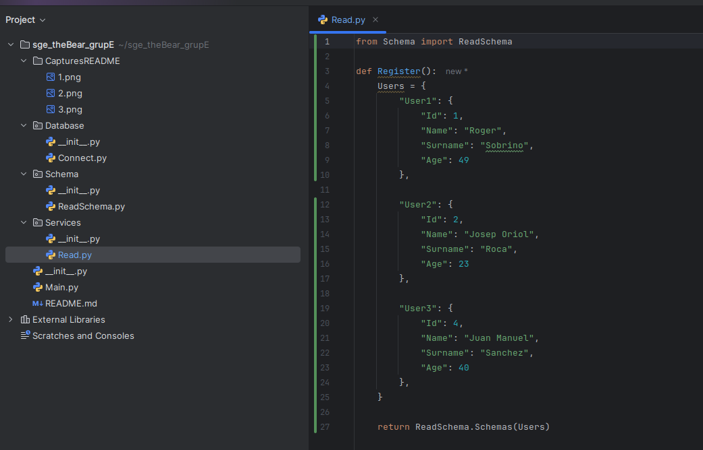

He afegit el codi de Main.py. (Accedeix al diccionari creat a read i basicament l'envia a la instancia de FastAPI que hem creat perque es pugui visualitzar)

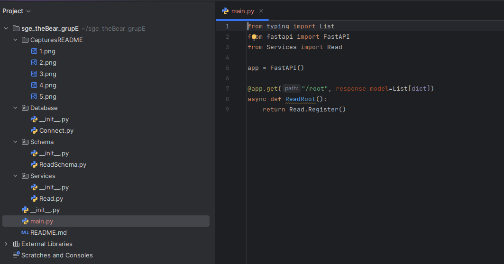

He carregat el uvicorn i podem veure que la informació és visible

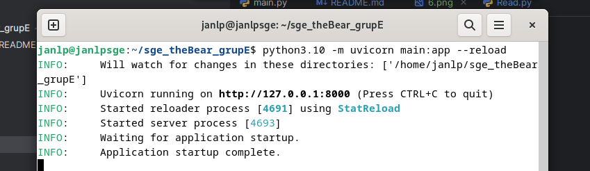

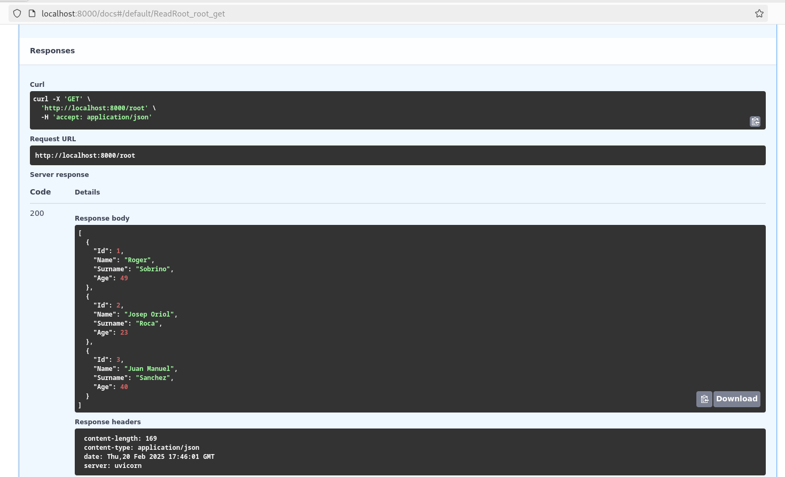

# Activitat 2 (FastAPI + Database)

Creo la llista de les dependencies i he cridat a pip per instal·lar tots els paquets

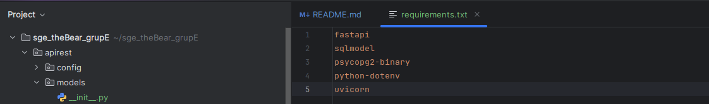

Creo el .env, que són les variables de l'entorn (també se'ls coneix com a secrets, guardem coses com credencials, tokens, etc. en els fitxers .env) 

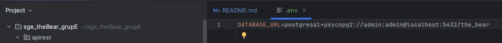

Creo el main.py sencer, es resumeix en:
- Carrega les variables d'entorn
- Una funció que genera una sessió a la base de dades, que está oberta fins que s'acaba l'interacció
- End point "get" que permet llegir tots els usuaris de la base de dades a través d'una crida al helper module "user"
- End point "post" que permet crear un usuari nou introduint el seu nom i correu

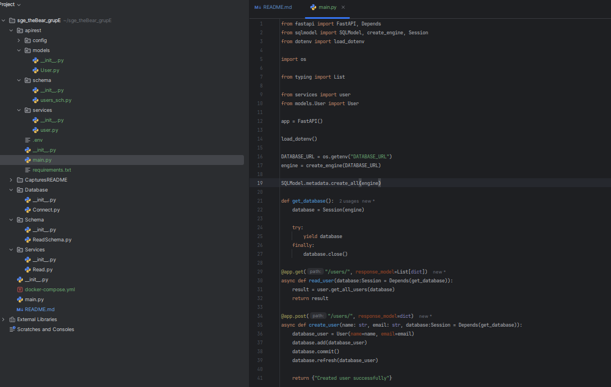

Creo el model d'usuari, que simplement em deixa crear una taula de SQL a través de una classe de python i fa de estructura de dades

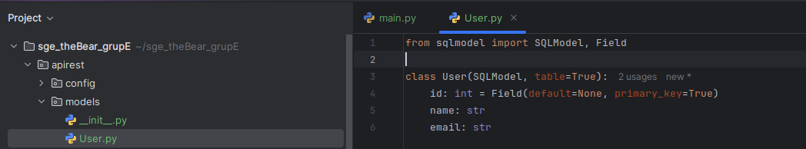

Creo el helper module per llegir en forma de llista tots els usuaris.

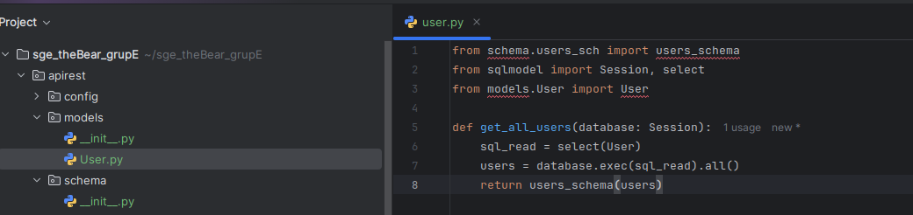

Els endpoints son completament funcionals!

Podem veure que apareixen, escriure i llegir dels endpoints.

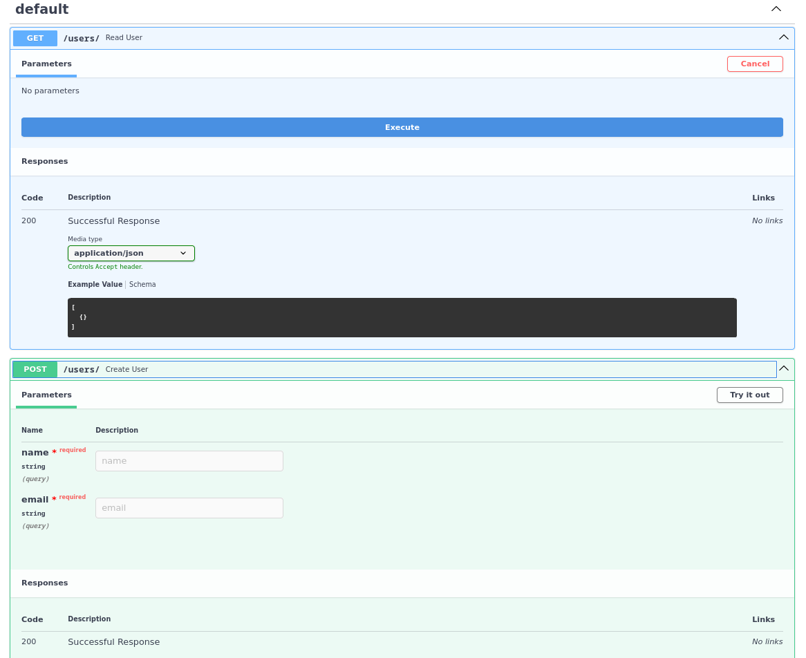
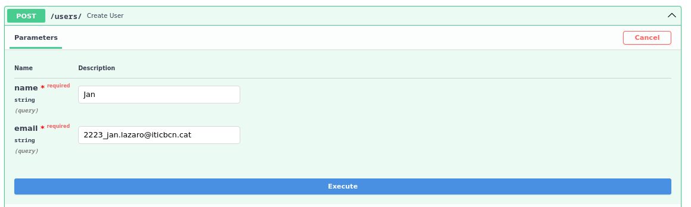
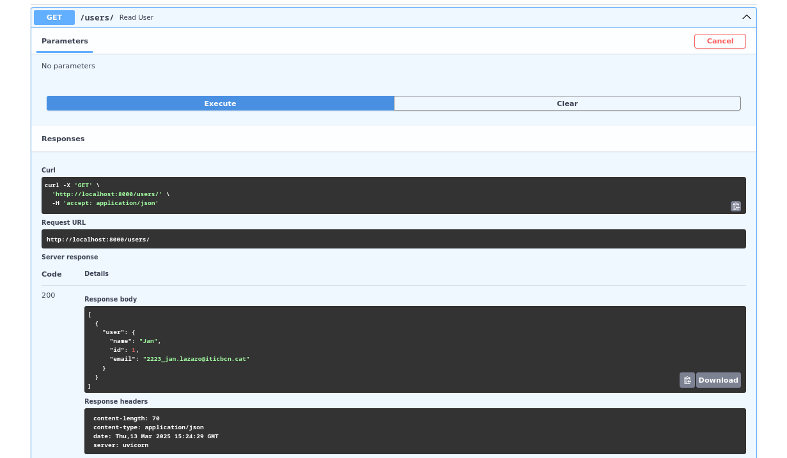