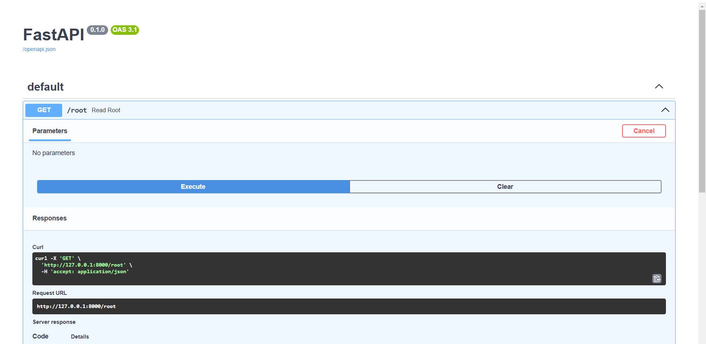
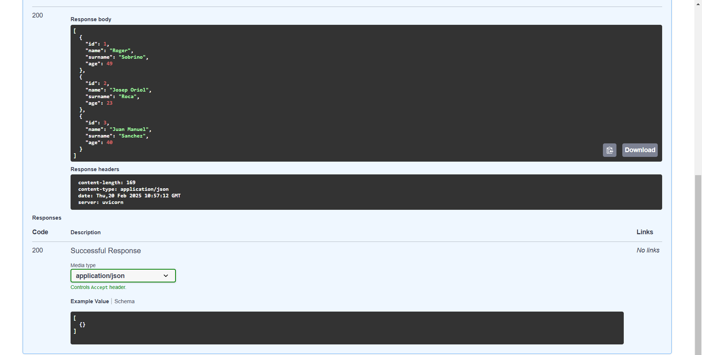
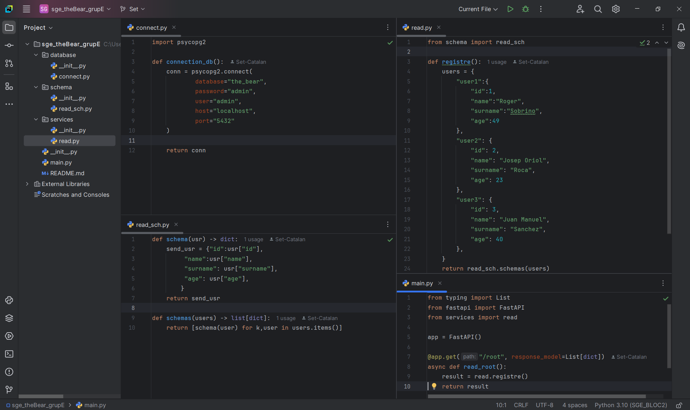
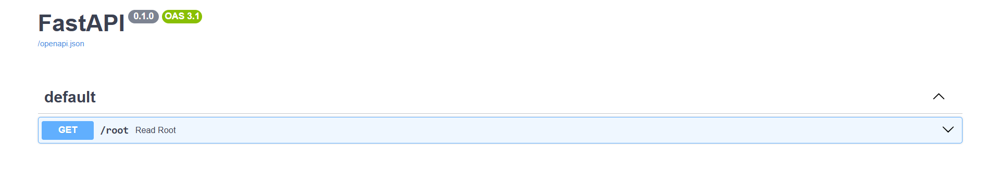
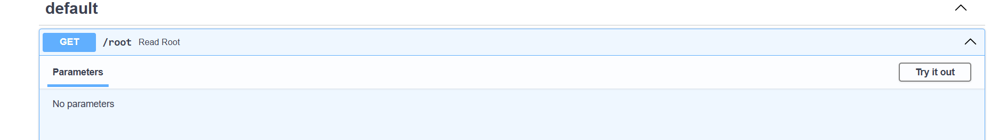
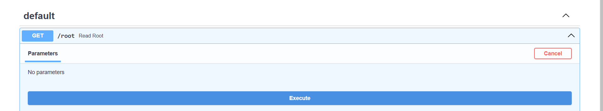

# sge_theBear_grupE

### Set Catalán Ribolleda

---

En aquesta pràctica farem un **PAS A PAS** per a crear 
un projecte de FastAPI per a mostrar l’ús d’un APIREST. 
Un cop acabat el tutorial, hauríem de veure aquesta pantalla:

---

## Creació dels fitxers

Primer cal crear els arxius de la següent imatge amb la 
mateixa estructura:

- En la carpeta *database* posarem el fitxer `connect.py`
que s'encarrega de fer la connexió amb psycopg2.
- En la carpeta *schema* posarem el fitxer `read_sch.py`
que s'encarrega de transformar les dades de users, que estan
en format *List*, a un format diccionari.
- En la carpeta *services* posarem el fitxer `read.py`
en el que posarem la lògia que permetrà treballar amb les 
consultes del client.
- En la carpeta principal posarem el fitxer `main.py` que
és el controlador que decidirà què farà el programa segons 
la consulta del client.

---

## Passos finals

Un cop està tot correcte haurem d'obrir un terminal i executar
la següent comanda:

    uvicorn main:app --reload

Si dona error proba a executar:
    
    pip install uvicorn

Una vegada iniciat has d'entrar en la següent url 
"http://127.0.0.1:8000/docs" i veuràs aquesta pantalla:

Cliquem en el desplegable.

Cliquem el botó que posa *Try it out*:

I per últim fem clic al botó *Execute*:

Fet aquest últim pas ja hauries de veure la pantalla que 
he mostrat al principi.